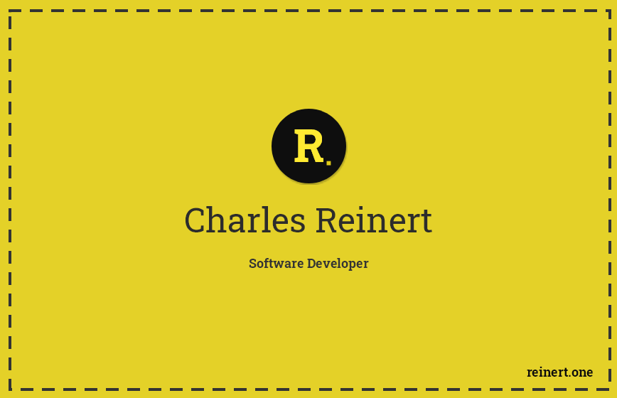

  
  

###  
I'm Charles, a full-time software developer 👨‍💻 with  4+ years of experience & DevOps background🚀
  
   

- 🔭 I’m currently working in Qlos 
(https://qlos.com/)  
  

- 🌱 I’m currently master my DevOps skills.   
  

- ❓ Ask me about anything related to DevOps, AWS, PHP + Laravel stack and related technologies  
  

   

## My Skill Set  
<table><tr><td valign="top" width="33%">

### Frontend  

  
  
  
  
  
  
  

</td><td valign="top" width="33%">

### Backend  

  
  
  
  
  
  
  
  
  

</td><td valign="top" width="33%">

### DevOps  

  
  
  
  
  
  
  
  
  
  

</td></tr></table>  

   

## Connect with me  
 

  

  
 

## Certificates
 

  

   
 

## Github Stats  

  

   

 
   

  

   

 

----

Generated using <a href="https://profilinator.rishav.dev/" target="_blank">Github Profilinator</a>

